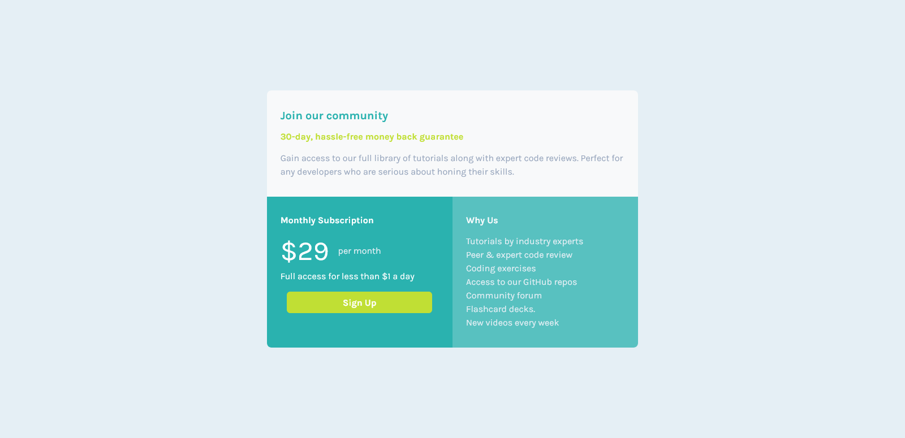
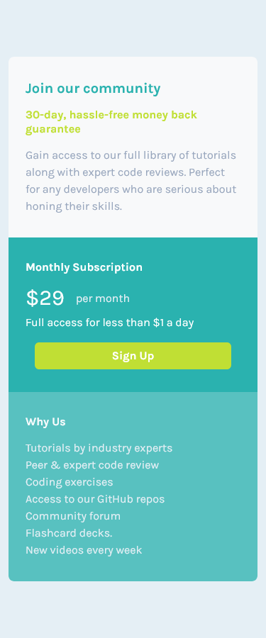

# Frontend Mentor - Single price grid component solution

This is a solution to the [Single price grid component challenge on Frontend Mentor](https://www.frontendmentor.io/challenges/single-price-grid-component-5ce41129d0ff452fec5abbbc). Frontend Mentor challenges help you improve your coding skills by building realistic projects. 

## Table of contents

- [Overview](#overview)
  - [Screenshot](#screenshot)
  - [Links](#links)
- [My process](#my-process)
  - [Built with](#built-with)
  - [What I learned](#what-i-learned)
  - [Continued development](#continued-development)
  - [Useful resources](#useful-resources)
- [Author](#author)
- [Acknowledgments](#acknowledgments)

## Overview

### Screenshot

### Links

- Solution URL: [Add solution URL here](https://your-solution-url.com)
- Live Site URL: [Add live site URL here](https://your-live-site-url.com)

## My process

### Built with

- Semantic HTML5 markup
- CSS custom properties
- Flexbox
- Mobile-first workflow
- [Bootstrap](https://getbootstrap.com/) - Bootstrap Library

### What I learned

In this project, I learned to include Bootstrap in the project, to use the Bootstrap library at a basic level and to customize the project by using Custom.css with Bootstrap.

### Continued development

I aim to develop my intermediate and advanced level of css and then learn Javascript->React-Vue libraries and frameworks. My goal is to learn back-end and become a fullstack developer after improving myself in the front-end part.

## Author

- Github - [Mustafa Olgun](https://github.com/mustafaolgun)
- Frontend Mentor - [Mustafa Olgun](https://www.frontendmentor.io/profile/mustafaolgun)
- Codepen - [Mustafa Olgun](https://codepen.io/mustafaolgun)

## Acknowledgments

Thank you very much for visiting this page. Please feel free to report my shortcomings, recommendations and suggestions.
Thank you for your interest.